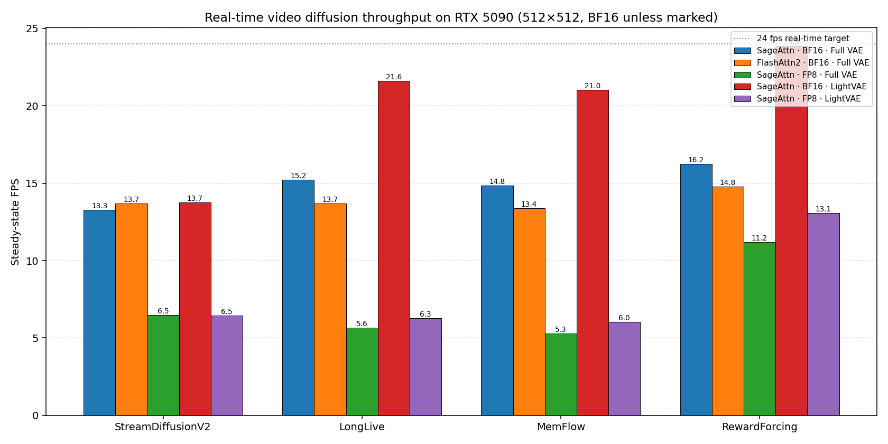
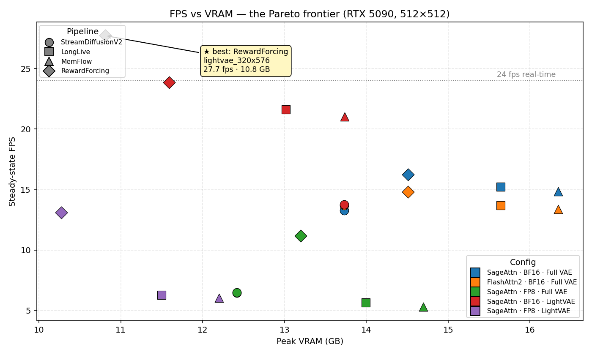
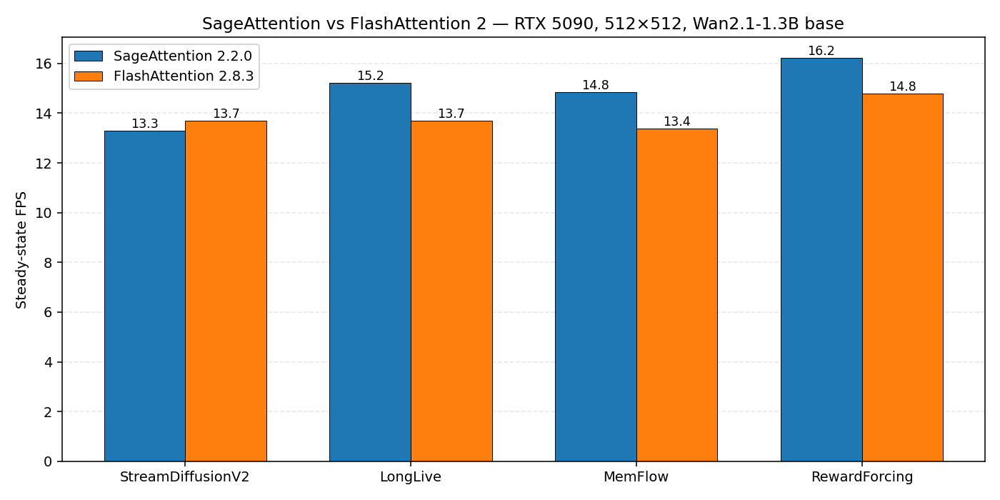
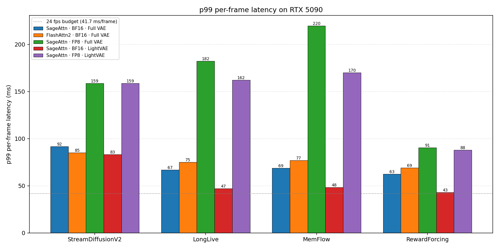

# Real-time video diffusion on an RTX 5090: 24 benchmarks, one trap, and a 24 fps finish line

*Rafal Leszko · April 2026*



---

## TL;DR

I spent a weekend running 24 benchmarks on four open-source real-time autoregressive video diffusion pipelines — **StreamDiffusionV2, LongLive, MemFlow, and RewardForcing** — all on a single RTX 5090. Five findings:

1. **Real-time video diffusion on a consumer 5090 is comfortably possible.** `RewardForcing + LightVAE` hits **23.9 fps at 512×512** and **27.7 fps at 320×576** — both with p99 inside the 24 fps frame budget and under 12 GB VRAM. That's real-time on a $2,000 card.
2. **FP8 is a trap on Blackwell (for these models).** Turning on `torchao` FP8 dynamic quantization **cut FPS in half** across every pipeline tested — from 13.3 fps to 6.5 fps on StreamDiffusionV2, 15.2 → 5.7 on LongLive. You save ~2 GB of VRAM; you pay 2.3× slower inference. Don't do it on a 32 GB card.
3. **LightVAE is the biggest single knob.** Swapping the full Wan VAE for the 75%-pruned LightVAE gave **+42–47% FPS** on every text-to-video pipeline. It matters 4–10× more than your attention backend.
4. **SageAttention 2.2.0 beats FlashAttention 2 by 10%** on text-to-video pipelines — and **loses to FA2 by 3%** on StreamDiffusionV2. Not the 2–5× the SageAttention paper advertises; at 1.3B params on Blackwell, attention just isn't the bottleneck.
5. **Pipeline choice matters.** All four share the same Wan 2.1 1.3B base, but steady-state FPS varies by **22%** at the same settings (RewardForcing 16.2 vs StreamDiffusionV2 13.3). Post-training recipe isn't a free lunch.

Raw numbers, the harness, and every JSON result file are in [`benchmarks/`](https://github.com/daydreamlive/scope/tree/main/benchmarks).

---

## Why I ran this

I lead engineering on [Daydream Scope](https://github.com/daydreamlive/scope) — an open-source runtime that wraps real-time video diffusion models behind one WebRTC-capable API. We ship four pipelines today. People ask me, roughly weekly, *which one is fastest? should I use FP8? does attention matter?* I never had a clean answer. So I built a benchmark harness inside Scope and ran 24 configurations until I did.

Everything below is on one box:

| | |
|---|---|
| GPU | NVIDIA GeForce RTX 5090 (Blackwell, sm_120), 32 GB |
| Driver | 590.48.01, CUDA 12.x |
| Dtype | BF16 (FP8 as an A/B variant via torchao) |
| Attention | SageAttention 2.2.0, FlashAttention 2.8.3 |
| Resolution | 512×512 (standardized); 320×576 + 480×832 sweeps |
| Measurement | 8 chunks per run, first chunk excluded as warmup |

Per-frame latency = chunk latency ÷ frames emitted, so pipelines that emit different chunk sizes are directly comparable. (StreamDiffusionV2 emits 4 frames/chunk; the text-to-video models emit 12.)

Every run is a fresh Python subprocess. That matters because **SageAttention vs FlashAttention 2 is resolved at import time** in this codebase — you can't toggle it at runtime without reloading the whole process. One subprocess per config is the only honest way to A/B them.

---

## The four pipelines

All four post-train on **Wan 2.1 T2V 1.3B** and add streaming (autoregressive chunked generation) with Self-Forcing-style distillation. Same backbone, different recipes:

| Pipeline | Authors | Training recipe | Mode |
|---|---|---|---|
| **StreamDiffusionV2** | Creators of StreamDiffusion | Self-Forcing DMD | video-to-video |
| **LongLive** | NVIDIA · MIT · HKUST · HKU · THU | Self-Forcing + long-context memory bank | text-to-video |
| **MemFlow** | Kling | Self-Forcing + Kling memory bank | text-to-video |
| **RewardForcing** | ZJU · Ant Group · HUST · SJTU | Rewarded Distribution Matching Distillation | text-to-video |

## 1. Head-to-head at baseline

Baseline = SageAttention · BF16 · Full Wan VAE · 512×512. This is what you get out-of-the-box on a 5090 when you pick a pipeline in Scope.

| Pipeline | Steady FPS | p50 ms/frame | p99 ms/frame | Peak VRAM (GB) |
|---|---:|---:|---:|---:|
| StreamDiffusionV2 | 13.3 | 72.4 | 91.9 | 13.7 |
| LongLive | 15.2 | 66.3 | 66.8 | 15.6 |
| MemFlow | 14.8 | 68.0 | 68.6 | 16.4 |
| **RewardForcing** | **16.2** | **62.3** | **62.6** | **14.5** |

**RewardForcing wins baseline** by 22% over StreamDiffusionV2 and ~7% over the other text-to-video models, at lower VRAM. Same base model, same 4-step denoising schedule — the advantage looks to come from having less built-in machinery (no permanent LoRA merge, smaller memory bank) than the LongLive and MemFlow recipes.

p99 / p50 is also interesting: text-to-video pipelines have ~1% p99/p50 inflation (very consistent); StreamDiffusionV2 is 27% (jittery — that chunky start plays out across the whole run). For real-time streaming, that jitter is what actually breaks your 24 fps budget, not the median.

Here's the full matrix on one chart — **FPS vs peak VRAM, Pareto view**:



The frontier is almost entirely BF16 + LightVAE (the red markers). FP8 + LightVAE (purple) squeaks onto the bottom-left corner if all you care about is minimum VRAM — but its FPS is half what the red diamond offers at only ~1.3 GB more VRAM. For every meaningful FPS/VRAM trade, the answer is "drop the VAE, not the precision."

---

## 2. Attention: the non-result that matters



Everyone cites the SageAttention 2.2.0 paper's "2–5× faster than FlashAttention." You will not see that here.

| Pipeline | SageAttn FPS | FA2 FPS | Δ |
|---|---:|---:|---:|
| StreamDiffusionV2 | 13.3 | 13.7 | **FA2 +3%** |
| LongLive | 15.2 | 13.7 | SageAttn +11% |
| MemFlow | 14.8 | 13.4 | SageAttn +11% |
| RewardForcing | 16.2 | 14.8 | SageAttn +10% |

Three reasons the delta is modest:

1. **The model is small.** Wan 2.1 T2V 1.3B is a fraction of the ~7B Hunyuan / CogVideoX models the SageAttention paper showcases. Attention's share of wall time scales with model size, so on a 1.3B model the attention kernel isn't the bottleneck.
2. **The sequence length is short.** Per-chunk sequence lengths here are ~1,000–4,000 tokens. The steeper SageAttention speedups show up at 8k+.
3. **Blackwell's BF16 matmul is already excellent.** FA2 on sm_120 is getting most of the peak TFLOPs the card can deliver.

The StreamDiffusionV2 inversion — FA2 beating SageAttention by 3% — is small, inside run-to-run noise, and worth calling out only because it's consistent with the pattern: when attention is a small share of wall time, the SageAttn INT8 quant/dequant cost eats the kernel savings. For shorter chunks (SDv2 emits 4 frames vs 12 for the text models), that share is smaller.

> **Footnote on FlashAttention 3.** I tried. Scope's attention dispatch hard-codes `FLASH_ATTN_3_AVAILABLE = is_hopper_gpu()`, so I patched it to force-enable FA3 on Blackwell. The `kernels-community/flash-attn3` hub kernel downloads fine, but the first attention call aborts with `CUDA error: no kernel image is available for execution on the device` — the published FA3 wheels don't include sm_120 binaries yet. So as of April 2026, FA3 on a 5090 is gated not by Scope's code but by the upstream kernel build. Worth re-trying in a quarter or two.

---

## 3. The FP8 trap

This is the one I want you to remember.

| Pipeline | BF16 FPS | FP8 FPS | Δ FPS | Δ VRAM |
|---|---:|---:|---:|---:|
| StreamDiffusionV2 | 13.3 | 6.5 | **−51%** | −1.3 GB |
| LongLive | 15.2 | 5.7 | **−63%** | −1.6 GB |
| MemFlow | 14.8 | 5.3 | **−64%** | −1.7 GB |
| RewardForcing | 16.2 | 11.2 | −31% | −1.3 GB |

FP8 quantization via `torchao.Float8DynamicActivationFloat8WeightConfig` **cut throughput in half** across the board, with VRAM savings of only 1.3–1.7 GB.

I'm not the first person to hit this. [vLLM issue #28234](https://github.com/vllm-project/vllm/issues/28234) reports the same story on Qwen3-4B: enabling online dynamic FP8 on an RTX 5090 drops throughput by ~17% vs BF16. The issue was closed as *not planned*, with the note that "the FP8 quantization path is not yet optimized or adapted for RTX 5090 GPUs." My video-diffusion numbers are worse (−51% to −64%) because the VAE decode phase magnifies every per-step overhead.

Why so bad? Two things compound:

- **Dynamic activation quantization recomputes the scale on every matmul**, adding a reduction pass over the activations every step.
- **Blackwell has native FP8 tensor cores, but the torchao path on sm_120 doesn't appear to be hitting them cleanly yet.** Without the matmul win, you pay the quant overhead and get a BF16-class compute path back.

**Rule of thumb on a 32 GB card:** don't enable FP8 unless VRAM is the hard constraint. If you're running a 7B+ model that doesn't fit otherwise, fine. For a 1.3B model with 15 GB of headroom — never worth it on this architecture today.

On Hopper (H100, Ada/L4, H200) the torchao FP8 path is mature and typically a win. The above is a Blackwell + small-diffusion-model observation, not a blanket "FP8 bad" claim.

---

## 4. LightVAE: the biggest knob no one talks about



The dotted line at 41.7 ms is the 24 fps frame budget. Only the red bars (LightVAE) clear it.

This is the single change with the largest speedup in the whole matrix.

| Pipeline | Full VAE FPS | LightVAE FPS | Δ | Δ VRAM |
|---|---:|---:|---:|---:|
| StreamDiffusionV2 | 13.3 | 13.7 | +4% | 0 GB |
| LongLive | 15.2 | 21.6 | **+42%** | −2.6 GB |
| MemFlow | 14.8 | 21.0 | **+42%** | −2.6 GB |
| **RewardForcing** | 16.2 | **23.9** | **+47%** | −2.9 GB |

Why LightVAE moves the needle 10× more than attention does: the **VAE decode dominates per-chunk latency** on these streaming pipelines.

Each chunk runs the diffusion transformer once, then the VAE decoder runs on every output frame. The full Wan VAE is a 3D convolutional decoder carrying a lot of weight; LightVAE is 75% pruned. For a 12-frames-per-chunk text-to-video pipeline, the VAE decode can take longer than the entire diffusion step.

StreamDiffusionV2 barely benefits (+4%) because (a) it emits only 4–5 frames per chunk and (b) it also needs the full VAE encoder for its video-conditioning path. The decode win is real but it's half offset by encode overhead.

**The 24 fps moment:** `RewardForcing + LightVAE` at 512×512 hits **23.86 fps** with a p99 of **43 ms/frame** and **11.6 GB peak VRAM** — the p99 just clips the 24 fps budget (41.7 ms/frame). Drop to 320×576 and it's **27.7 fps with a p99 of 40.3 ms and 10.8 GB** — fully inside the budget, every frame. That is real-time video diffusion on consumer hardware.

Quality trade-off: LightVAE introduces noticeable reconstruction artifacts in fine detail — hair, text, small textures. For live demos, broadcast overlays, and AR use-cases, it's usually an obvious yes. For final output renders, use Wan VAE.

---

## 5. Resolution scales linearly with pixel count

Ran StreamDiffusionV2 at three resolutions (baseline config):

| Resolution | Pixels | FPS | p50 ms/frame | Peak VRAM |
|---|---:|---:|---:|---:|
| 320×576 | 184k | 15.0 | 62 | 12.4 GB |
| 512×512 | 262k | 13.3 | 72 | 13.7 GB |
| 480×832 | 399k | 10.6 | 94 | 16.1 GB |

Pixel-normalized latency is within 10% across all three, which means **the diffusion transformer scales almost exactly with sequence length**. No surprises, but confirms that if you want 24 fps on a non-LightVAE config, you drop resolution first.

---

## 6. So what config should I actually run?

I'll make this concrete. If your constraint is:

- **Hard real-time (24 fps, p99 inside budget)** → `RewardForcing + LightVAE @ 320×576` → **27.7 fps, 10.8 GB, p99 40.3 ms** (fits budget every frame)
- **Real-time at 512×512** → `RewardForcing + LightVAE @ 512×512` → 23.9 fps, 11.6 GB (p99 barely clips budget)
- **Best quality, still fast** → `RewardForcing + Full VAE @ 512×512` → 16.2 fps, 14.5 GB
- **Longest-context consistency** → `MemFlow + LightVAE` → 21.0 fps, 13.7 GB
- **Video-to-video (StreamDiffusionV2)** → baseline is your best — LightVAE barely helps, FP8 hurts
- **You own an H100 instead of a 5090** → benchmark again. FA3 is eligible on Hopper and the FP8 torchao path likely flips. Different story.

---

## 7. $/minute napkin math

Assume a fully-loaded RunPod 5090 at roughly $0.70/h (community cloud, fluctuates weekly):

| Config | FPS | Minutes of video / $1 | $/min of video |
|---|---:|---:|---:|
| SDv2 baseline | 13.3 | 1.14 | $0.88 |
| RewardForcing baseline | 16.2 | 1.39 | $0.72 |
| RewardForcing + LightVAE @ 512×512 | 23.9 | 2.05 | $0.49 |
| **RewardForcing + LightVAE @ 320×576** | **27.7** | **2.37** | **$0.42** |
| Any + FP8 | 5–11 | 0.43–0.94 | $1.07–2.33 |

**Best realistic knob: switch the VAE. Halve your cost per minute of output. Skip FP8.**

On Hopper (H100 at roughly $2.50/h on RunPod Community), you need ~3.5× the FPS to equalize $/minute. That's likely achievable with torch.compile + CUDA graphs + FA3, but it requires the work, and the 5090 offers a better $/min baseline than I expected going in.

---

## 8. What I didn't benchmark (and why you might care)

- **FlashAttention 3 on Blackwell.** I tried; the hub kernel has no sm_120 binary yet (see footnote above). Waiting on the upstream wheel, not on Scope's dispatch.
- **torch.compile + CUDA graphs.** One warmup cost, zero-overhead at steady state. I'd bet this is a bigger single win than any of the knobs above, especially on the consistency of p99.
- **FP4 attention (SageAttention 3).** Paper claims 1038 TOPS on RTX 5090 (5× over FA2). Not wired into Scope yet.
- **CLIP / LPIPS / VBench.** I did not run a proper quality sweep. Visual diffs across configs are the obvious next sweep — and the one that matters most for the LightVAE trade-off.
- **H100, H200, B200, MI300.** Single-box study. Cloud runs are next.
- **Plugin pipelines, VACE, LoRA overhead, multi-stream batching.** All doable with this harness. The harness is the scaffolding; the matrix is the first slice.

---

## 9. Try it yourself

```bash
git clone https://github.com/daydreamlive/scope
cd scope
uv sync --group dev
uv run python benchmarks/bench.py
```

The harness is `benchmarks/run_one.py` (one config per subprocess) and `benchmarks/bench.py` (driver). All 24 JSONs, the plotting script, and the hero images above are committed under `benchmarks/`. If you have a different GPU, send me a PR with your JSONs and I'll fold your numbers into the next post.

---

## Closing

The fun part of benchmarking is finding the places where conventional wisdom is wrong. Two here:

- Attention backend is not the first knob you should touch for a 1.3B streaming video model. It's maybe the fourth.
- FP8 is not a free lunch on Blackwell. Right now it's not even a paid lunch; it's a net cost.

And the mundane-but-actionable part: for real-time video diffusion on consumer hardware in 2026, **pick RewardForcing, swap to LightVAE, leave attention and quantization alone**. That's a comfortable >24 fps config at **$0.42/minute** of output on a $2,000 card.

I'll rerun this matrix on Hopper once I get access, and will fold in torch.compile + FA3 once the patches land in Scope. Discussion and disagreements welcome — hit me up on GitHub or the links below.

---

*Thanks to the teams behind StreamDiffusionV2, LongLive, MemFlow, and RewardForcing for the open pipelines, and to the SageAttention and FlashAttention authors for the kernels this post measures. All four pipelines are open source; original papers are linked from their respective folders in the [Scope repo](https://github.com/daydreamlive/scope/tree/main/src/scope/core/pipelines).*

---

**About me.** I lead AI engineering on [Daydream Scope](https://github.com/daydreamlive/scope). Background in real-time audio/video, Kubernetes, and distributed systems. [rafalleszko.com](https://www.rafalleszko.com) · [github.com/leszko](https://github.com/leszko) · [LinkedIn](https://www.linkedin.com/in/rafal-leszko/)
